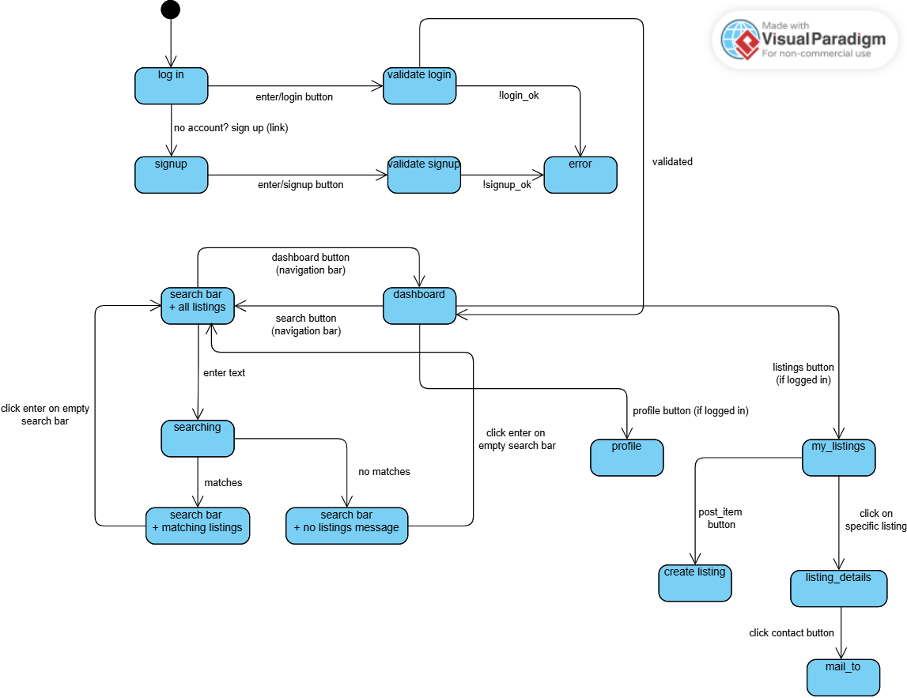
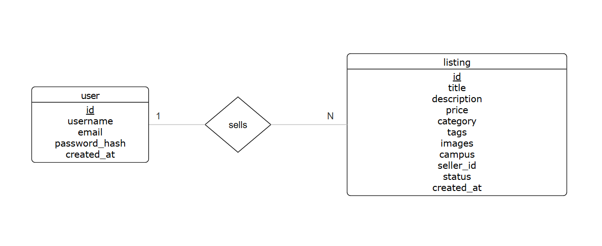

# CampusTrade
A second-hand marketplace for college students. You can post items, browse listings, and search for things you need on campus. Users need a valid email to create an account.
This project was built by a team of 3 students: Alice Wei, Ella Han, Filly Essai Garcia

### Tech Stack
Frontend: React + Vite + Material UI
Backend: Node.js + Express
Database: SQLite
Auth: bcrypt + JWT
### Project Structure
```
CS-35L/
├── src/                    # frontend code
│   ├── frontend/           # all the pages
│   │   ├── Login_Signup.jsx
│   │   ├── dashboard.jsx
│   │   ├── ListingsPage.jsx
│   │   ├── CreateListing.jsx
│   │   ├── ListingDetail.jsx
│   │   ├── Search.jsx
│   │   └── Profile.jsx
│   └── services/           # API calls
│       ├── authService.js
│       ├── listingService.js
│       └── profileService.js
└── server/                 # backend code
├── index.js            # all the routes
├── database.js         # database setup
└── uploads/            # uploaded images
```
### How to Run Locally:
Requirements
Node.js (v18 or higher)
npm
1. Clone the repo
git clone https://github.com/ellahan296-beep/CS-35L.git
cd CS-35L
2. Install frontend dependencies
npm install
3. Install backend dependencies
cd server
npm install
cd ..
4. Start the backend
Open a terminal and run:
npm run backend
You should see: Server running at http://localhost:9999
5. Start the frontend
Open a new terminal tab and run:
npm run dev
Then open your browser and go to http://localhost:5173
Features
-Sign up and log in with email and password
-Browse all active listings on the home page
-Search for listings by keyword
-Browse your own listing page when you log in
-Post a new listing with title, description, price, category, campus, and image
-Click into a listing to see full details and seller info
-Mark your listing as sold
-Delete your listing
-View your profile
### Testing
We wrote e2e tests using Playwright covering:
-login-signup.spec.js — signup, login, invalid credentials
-listings.spec.js — create listing, view detail, mark as sold, delete listing
-search.spec.js — search by keyword
-profile.spec.js — view profile info

### Run the tests
Make sure both frontend and backend are running, then: bashnpx playwright test
To view the test report: bashnpx playwright show-report

### System Architecture
```
Browser (React + Vite)
│
│  HTTP requests (fetch)
│
Express Server (Node.js) — port 9999
│
│  SQL queries
│
SQLite Database (campustrade.db)
```

### Page Flow


### ER Diagram

